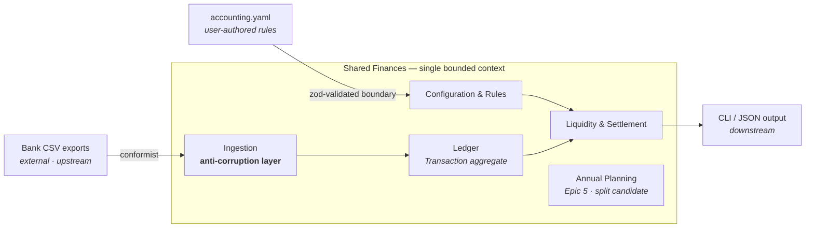

# Context map — the strategic view

Where the language of [glossary.md](glossary.md) applies, what lives at the edges, and how the outside world is kept from corrupting the model.

## One bounded context

**Decision: a single bounded context — "Shared Finances" — with named modules.** Every term in the glossary means the same thing everywhere in `src/core/`: a Transaction in ingestion is the same Transaction in the ledger and in settlement math. One team (one household!), one language — multiple contexts would add translation layers nobody needs yet.

Modules inside the context (mapped from `src/core/` folders and [prd.md](../prd.md) FR groups):

| Module | Core folders | Speaks mostly of |
| --- | --- | --- |
| Ledger | `ledger/`, `shared/` | Transaction, Entry, Money, double-entry invariant |
| Ingestion | `ingest/` | Canonicalization, idempotency hash, auto-tagging |
| Liquidity & Settlement | `buffers/`, `recurring/`, `splits/`, `transfer/` | Buffer, forecast occurrence, split rule, safe transfer |
| Configuration & Rules | `config/`, `categories/` | Validity window, partner, category |
| Annual Planning *(Epic 5)* | — | Plan file, revision, challenger *(language TBD)* |

## The map

## Relationships at the edges

- **Bank CSV exports → Ingestion (conformist upstream).** Banks dictate their formats; we adapt. The ingestion module's canonicalization is our **anti-corruption layer**: bank dialect never leaks past it — inside the context there are only canonical ingest items and glossary vocabulary.
- **`accounting.yaml` → Configuration (validated boundary).** User-authored policy enters through Zod validation at the infra boundary; Core only ever sees typed, window-resolved rules.
- **Shared Finances → CLI/JSON (downstream).** Presentation conforms to the domain, never the reverse. Output vocabulary (tables, `--json` shapes) uses glossary terms.

## When would we split?

**Tripwire — recorded now, checked at Epic 5 planning:** Annual Planning is the first candidate for a second bounded context *if its language diverges* — if "proposal", "plan file", "depletion classification" start needing translation to and from ledger vocabulary rather than sharing it. Signals to watch: the same word wanting two meanings (e.g. "plan"), or planning-only concepts leaking guard clauses into ledger/settlement code. Until a divergence is observed, it stays a module.
