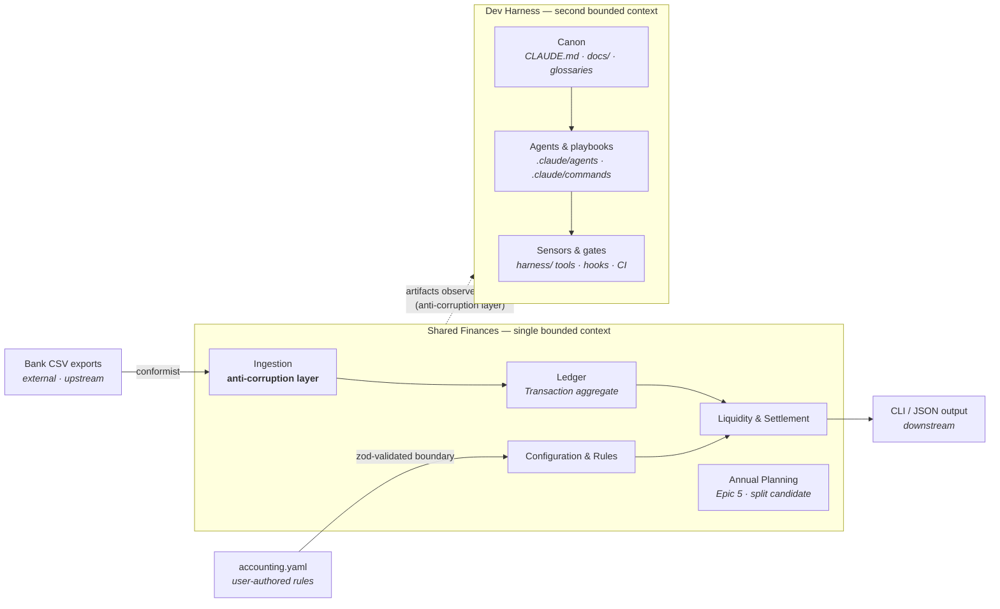

# Context map — the strategic view

Where each language applies, what lives at the edges, and how the outside world is kept from corrupting the models. Two languages live in this repo: the product's ([glossary.md](glossary.md)) and the dev harness's ([../harness/glossary.md](../harness/glossary.md)).

## Two bounded contexts

**Decision (story-ddd-2, 2026-07-04): two bounded contexts — "Shared Finances" (the product) and "Dev Harness" (the control system that develops it) — each with its own user-owned glossary.** They share no vocabulary: words that appear on both sides ("rule", "gate", "window") mean different things per context, and that is deliberate.

**Shared Finances** keeps its original decision: a single context with named modules. Every term in the product glossary means the same thing everywhere in `src/core/`: a Transaction in ingestion is the same Transaction in the ledger and in settlement math. One team (one household!), one language — multiple *product* contexts would add translation layers nobody needs yet.

**Dev Harness** spans `.claude/**` (sub-agents, slash commands/skills, hooks, settings), CLAUDE.md, the `docs/` canon, and `harness/` tools. Its boundary is *logical, not physical*: `.claude/` placement is Claude Code's discovery contract, and the `harness/` folder holds only the domain's computational tools. Language and classification: [harness glossary](../harness/glossary.md) · [control inventory](../harness/control-inventory.md).

Modules inside the context (mapped from `src/core/` folders and [prd.md](../prd.md) FR groups):

| Module | Core folders | Speaks mostly of |
| --- | --- | --- |
| Ledger | `ledger/`, `shared/` | Transaction, Entry, Money, double-entry invariant |
| Ingestion | `ingest/` | Canonicalization, idempotency hash, auto-tagging |
| Liquidity & Settlement | `buffers/`, `recurring/`, `splits/`, `transfer/` | Buffer, forecast occurrence, split rule, safe transfer |
| Configuration & Rules | `config/`, `categories/` | Validity window, partner, category |
| Annual Planning *(Epic 5)* | — | Plan file, revision, challenger *(language TBD)* |

## The map

## Relationships at the edges

- **Bank CSV exports → Ingestion (conformist upstream).** Banks dictate their formats; we adapt. The ingestion module's canonicalization is our **anti-corruption layer**: bank dialect never leaks past it — inside the context there are only canonical ingest items and glossary vocabulary.
- **`accounting.yaml` → Configuration (validated boundary).** User-authored policy enters through Zod validation at the infra boundary; Core only ever sees typed, window-resolved rules.
- **Shared Finances → CLI/JSON (downstream).** Presentation conforms to the domain, never the reverse. Output vocabulary (tables, `--json` shapes) uses glossary terms.
- **Shared Finances → Dev Harness (observed through an anti-corruption layer).** Harness parsers (`drift-parser`, `agent-spec`, dod-check's readers) consume product-context artifacts — plans, retros, CLAUDE.md, the product glossary — as **data**: text in, harness findings out, product vocabulary never entering harness language. The reverse direction (the harness *governing* how product work proceeds) is process, not data — it flows through CLAUDE.md's guides and gates, not through this map's edges.

## When would we split?

**Tripwire — recorded now, checked at Epic 5 planning:** Annual Planning is the first candidate for a further *product* context split *if its language diverges* — if "proposal", "plan file", "depletion classification" start needing translation to and from ledger vocabulary rather than sharing it. Signals to watch: the same word wanting two meanings (e.g. "plan"), or planning-only concepts leaking guard clauses into ledger/settlement code. Until a divergence is observed, it stays a module.

**Tripwire — Dev Harness language leakage (story-ddd-2):** if harness terms start appearing in `src/core/` identifiers, or product terms start being *used* (not just parsed) inside `harness/` code and agent specs, the ACL is failing — revisit the boundary at the next harness story rather than letting the languages blend.
