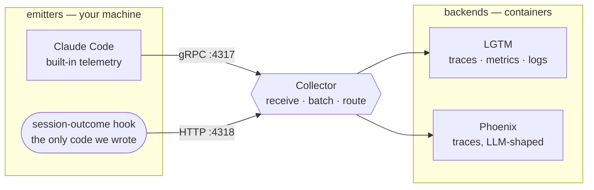
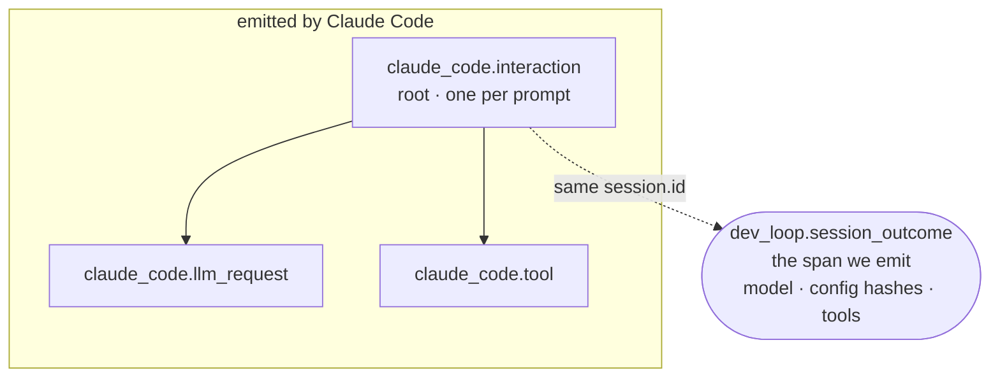

# How the observability stack works

What every moving part does, why it exists, and where each one bit us — from
OpenTelemetry vocabulary through Docker to the one span this project actually
writes.

Written for someone who has not run an observability stack before. If you only
want to start it, the [README](../README.md) is enough.

---

## 1. What this is for

Two questions need answering, and they are different questions.

**Is the number right?** That is `sluice-verify`. It watches the product in
production — predicted transfer versus what actually had to move. Specs and
tests answer part of it; only production data answers the rest.

**Is the way we build working?** That is `dev-loop-evals`. It watches the
*agent*: how sessions went, under what configuration, with what result.

Both need the same machinery — something that records events with timings and
structure, and somewhere to look at them. So this builds it once and labels the
two workloads differently. That is why this directory is not named after either
product, and why the observability work is not competing with the product for
time.

> **Why this comes before any product code**
>
> A recording of a session is only useful later if you know *what produced it* —
> which model, which instructions, which tools. That context cannot be
> reconstructed after the fact. Every session recorded before this exists is
> unattributable, so capture has to come first, once.

---

## 2. The vocabulary

Six terms carry the whole design.

**span** — one unit of work that took time. A stopwatch with a label: a name, a
start, an end, and a bag of key–value attributes. `claude_code.tool` is a span.
So is a single API call.

**trace** — a *tree* of spans belonging to one operation. Every span in it
carries the same **trace ID**, and each records its **parent span ID**, which is
what makes it a tree rather than a pile. Rendered, it is the staircase-shaped
"waterfall" you have seen in profilers.

**signal** — OpenTelemetry carries three kinds of data. **Traces** (what
happened, in what order, how long), **metrics** (numbers over time), and **logs**
(text events). Claude Code emits all three, which has consequences below.

**attribute** — a key–value pair on a span. Where the interesting content lives:
`session.id`, the model name, a config hash.

**resource** — attributes describing the *emitter* rather than the event, most
importantly `service.name`. This is how one pipeline holds two workloads without
confusing them.

**OTLP** — OpenTelemetry Protocol, the wire format. Two transports, both used
here: **gRPC on 4317** (compact, binary) and **HTTP on 4318** (plain JSON you can
write with `curl`).

One more, because the design hinges on it:

**trace context** — how a trace ID travels between processes so work in a child
joins the parent's tree instead of starting a lonely one. The standard carrier is
a string called `traceparent`:

```
00-4bf92f3577b34da6a3ce929d0e0e4736-00f067aa0ba902b7-01
│  │                                │                │
│  │                                │                └─ flags
│  │                                └─ parent span ID (16 hex)
│  └─ trace ID (32 hex)
└─ version
```

Claude Code sets this as an environment variable for processes it spawns. That
single fact is what lets our hook place its span *inside* the session's trace.

---

## 3. Three moving parts

Emitters produce telemetry. A collector routes it. Backends store and display it.



Everything emits to the collector; nothing addresses a backend directly. That
indirection is the point — either backend can be replaced without touching a
single emitter.

### Why a collector rather than sending straight to a backend

You *can* point an application at a backend directly. The collector earns its
place for three reasons: emitters learn **one address** forever; it **batches**,
so a chatty process does not open a connection per span; and it can enforce a
**memory ceiling**, so telemetry never starves the machine it is observing.

Here the fan-out is the immediate payoff. Two backends want the same traces, and
neither emitter knows the other exists.

### Why two backends

**LGTM** is four tools in one container — Grafana to look at things, Tempo for
traces, Prometheus for metrics, Loki for logs. Claude Code emits all three
signals, so a trace-only backend would silently discard two-thirds of what
arrives.

**Phoenix** is built for LLM work specifically: it treats prompts and responses
as first-class things and can run evaluations over recorded sessions. That is
what `dev-loop-evals` will eventually need.

---

## 4. Docker, only the parts in play

Four concepts explain every line of [`compose.yaml`](../compose.yaml).

**image** — a frozen filesystem plus a default start command. An application and
everything it needs, pinned. `grafana/otel-lgtm:0.30.2` is a specific published
build; pinning means the stack is identical next month.

**container** — a running instance of an image, isolated from your machine: its
own filesystem and its own network view. Delete it and nothing is left behind,
which is exactly why volumes exist.

**volume** — storage that outlives the container. `lgtm-data` keeps recorded
traces across restarts.

**bind mount** — a file from the repo made visible inside a container. How the
collector config gets in:

```yaml
volumes:
  - ./otel/config.yaml:/etc/otel/config.yaml:ro
#   │                  │                    └─ read-only
#   │                  └─ path inside the container
#   └─ path in the repo
```

The config stays version-controlled and reviewable; the container just reads it.

### Ports: the two numbers are different machines

```yaml
ports:
  - "4317:4317"
#    │    └─ inside the container
#    └─ on your machine
```

Only the left-hand number is reachable from your laptop. Note what is *not*
published: LGTM and Phoenix expose their web interfaces (`3000`, `6006`) but not
their OTLP ports. They are unreachable from outside, deliberately — everything
must go through the collector.

### The private network, which explains a confusing line

Compose puts these containers on a private network where each is addressable *by
its service name*. That is why [`otel/config.yaml`](../otel/config.yaml) says:

```yaml
exporters:
  otlp/lgtm:
    endpoint: lgtm:4317      # not localhost:4317
```

From inside the collector container, `localhost` means *the collector itself*.
The hostname `lgtm` resolves to the sibling container. This trips up nearly
everyone once: the same address means different things depending on which side of
the container boundary you are standing on.

> **Trap — `depends_on` is not readiness**
>
> `depends_on` controls *start order*, not *readiness*. The collector starts the
> instant the other containers exist, then logs `connection refused` for several
> seconds while they are still booting. Nothing is broken and it resolves itself,
> but the logs look alarming for the first ten seconds after `just up`. Expect it.

---

## 5. Claude Code × OpenTelemetry

Claude Code is already instrumented. The work is switching it on and pointing it
somewhere — not writing spans.

```
CLAUDE_CODE_ENABLE_TELEMETRY=1
CLAUDE_CODE_ENHANCED_TELEMETRY_BETA=1   # traces are beta-gated
OTEL_TRACES_EXPORTER=otlp
OTEL_METRICS_EXPORTER=otlp
OTEL_LOGS_EXPORTER=otlp
OTEL_EXPORTER_OTLP_PROTOCOL=grpc
OTEL_EXPORTER_OTLP_ENDPOINT=http://localhost:4317
OTEL_SERVICE_NAME=dev-loop           # which workload this is
```

What arrives, already correctly parented:

| Span | What it covers |
|---|---|
| `claude_code.interaction` | the root — one per prompt you send |
| `claude_code.llm_request` | a call to the model |
| `claude_code.tool` | a tool invocation, including time blocked on your approval |
| `claude_code.hook` | a hook running |

Every one carries `session.id`. Remember that — it is the join key the whole
design leans on.

> **Trap — the shell is the wrong place for these**
>
> The obvious move is `source env.sh && claude`. That works only if Claude Code is
> launched *from that shell*. Launched from the GUI it inherits nothing, and the
> failure is **silent**: telemetry appears configured and emits nothing at all.
>
> So the variables live in an `env` block in `.claude/settings.json`, which Claude
> Code reads itself. It works either way it is started, and version-controls with
> the repo rather than living in someone's shell profile.

> **Trap — two beta gates, not one**
>
> Traces are beta. **Interactive** sessions additionally require organisation
> allow-listing; headless `-p` sessions do not. If the outcome span shows up but
> the waterfall never does, that gate is the cause — not the configuration.

### The subprocess rule, and its one exception

Claude Code deliberately does **not** pass `OTEL_*` to processes it spawns —
hooks, Bash commands, MCP servers. Otherwise every subprocess would inherit an
exporter it never asked for.

But it *does* pass `TRACEPARENT`. The consequence: a hook cannot discover where to
send telemetry, but it *can* discover which trace it belongs to. Both halves shape
the hook below — it takes its endpoint from its own variable, and its trace
context from the environment.

---

## 6. The one thing this project writes

Everything above is configuration. [`hooks/session-outcome.ts`](../hooks/session-outcome.ts)
is the only actual program.

We want to record, per session, what configuration produced it — model, hashes of
the instruction files, which tools were enabled. The natural home is the root
span. That is impossible: **a span is immutable once emitted, and you cannot
modify a span you did not create.** The root belongs to Claude Code.

So the fingerprint rides its own span, emitted alongside, carrying the same
`session.id`:



Joined on `session.id` when queried. Its position in the tree depends on what the
hook inherits: with `TRACEPARENT` set it becomes a child of the span that was
active and appears in the waterfall; without it, it is the root of a separate
trace and `session.id` is the only link. Either way the fingerprint is
queryable — the waterfall is the bonus, not the mechanism.

### How it runs

Two hooks on one script. **`SessionStart`** writes down the time. **`Stop`**
gathers the fingerprint and emits the span covering the whole session.

It has **no dependencies at all** — it builds the OTLP JSON by hand and posts it
with `fetch`. Two reasons. There is no `package.json` in this repository and the
product's language is still undecided; adding an SDK would quietly decide it. And
an SDK would have to track a trace format still in beta, whereas hand-written JSON
does not care what shape the native spans take.

This is also why it posts to **4318** (HTTP/JSON) while Claude Code uses **4317**
(gRPC): gRPC needs a library, plain JSON needs nothing.

> **Trap — the one that mattered**
>
> The rule was: *a dead telemetry endpoint must never stall a session.* The first
> version set a 2-second timeout and looked correct.
>
> It was not. That timeout does not cover the phase where a connection is still
> being *established*, so against an address that accepts nothing and answers
> nothing, the hook ran for **ten seconds** — added to the end of every session.
>
> What made it findable was testing *both* failure shapes. A **refused**
> connection fails instantly, so a stack that is simply not running looks fine. A
> **black-holed** address hangs. Testing only the first would have passed while the
> real stall shipped. The fix is a hard watchdog that exits regardless.

---

## 7. Running it

```bash
cd observability
just up              # start all three containers
just smoke           # push one span end to end
just smoke-offline   # stack DOWN: prove a dead endpoint can't stall a session
just down
```

Then Grafana at <http://localhost:3000> and Phoenix at <http://localhost:6006>.

### What "verified" had to mean

The collector returning `200` proves only that it *accepted* the span — not that
either backend stored it. A misrouted exporter returns `200` and drops everything
on the floor. So verification queried both backends directly and confirmed the
same trace ID present in each.

Worth keeping as a habit: an acknowledgement from the first hop is not evidence of
arrival at the last.

| Condition | First cut | Now |
|---|---|---|
| Collector refuses the connection | 0s | 0s |
| Collector accepts nothing, answers nothing | 10s | 2s |
| Session fails because telemetry failed | never | never |

---

## 8. What is deliberately absent

This is phases **A** (capture) and **B** (fingerprint). Three more exist and are
all gated:

- **C — outcomes.** The hook grows: run the tests, score the change, attach the
  result. Needs a test suite, which needs a product.
- **D — replay.** Re-run known tasks against pinned v0.1 commits to detect whether
  a change to the way we build helped or hurt.
- **E — dashboards as code.** Last, because a dashboard over three sessions of
  data teaches nothing.

The ordering is the guard-rail. Five phases of tooling with no product in use is
precisely the failure this restart exists to avoid, so C, D and E sit behind the
dogfood gate: if no real use has been recorded in fourteen days, all non-product
work stops.

---

*Every trap described here was hit and fixed while building this. None is
hypothetical.*
